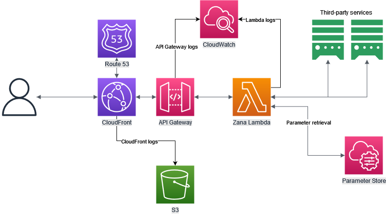

# Contributing to Zana

Thank you for taking time to contribute to Zana.

In this guide, you will get an overview of the contribution workflow from opening an issue, creating a PR, reviewing, and merging the PR.
The guide will also show you how to set up your local environment for making changes to, building and testing Zana.

By participating to Zana, you are expected to uphold our [Code of Conduct](./CODE_OF_CONDUCT.md).

### Table of Contents

- [Questions and Discussions](#questions-and-discussions)
- [Reporting a Bug](#reporting-a-bug)
- [Suggesting Enhancements](#suggesting-enhancements)
- [Local Setup and Development](#local-setup-and-development)
  - [Services](#services)
  - [Deployment](#deployment)
  - [Extension](#extension)
- [Style Guides](#style-guides)
  - [Git Commit Messages](#git-commit-messages)
  - [Services/Release (Rust) Style Guides](#services-style-guides)
  - [Extension (JavaScript) Style Guides](#extension-style-guides)
  - [Deployment (Java) Style Guides](#deployment-style-guides)
- [Pull Requests](#pull-requests)
- [Adding Support For a New Bookstore](#adding-support-for-a-new-bookstore)
- [How To Handle Breaking Changes](#how-to-handle-breaking-changes)

## Questions and discussions

If you have any questions, or you are interested to discuss about Zana, feel free to add a comment with your question on the open
[Zana Q&A](https://github.com/kushtrimh/zana/discussions/17) discussion, or create a new discussion yourself on our [discussions](https://github.com/kushtrimh/zana/discussions) page.

## Reporting a bug

If you come across any problems with Zana, and want to report an issue, you can follow this guide.
Before reporting a new bug issue however, please check the [issues](https://github.com/kushtrimh/zana/issues) page in case
a similar bug has already been reported.

To create a bug issue, you can go on the [issues](https://github.com/kushtrimh/zana/issues) page and click on the `New issue` button.
You will be redirected to another page with a list of issues templates, and there you can choose the `Bug report` [template](.github/ISSUE_TEMPLATE/bug_report.md).

For the title of the bug issue, please give something short that best describes your problem.
On the bug report content pane, a list of headings will show the expected information.
Please make sure to add as many details as you can. 
Steps to reproduce, console log errors, screenshots, browser type and version are particularly helpful to resolve the issue faster.

If you simply have a question about Zana, please do not raise a new bug issue for it, instead check our 
[questions and discussions](#questions-and-discussions) section.

## Suggesting enhancements

If you want to suggest a new feature or improvement for Zana, you can follow this guide.
Before creating a new enhancement issue however, please check the [issues](https://github.com/kushtrimh/zana/issues) page in case
a similar enhancement has already been suggested.

To create an enhancement issue, you can go on the [issues](https://github.com/kushtrimh/zana/issues) page and click on the `New issue` button.
You will be redirected to another page with a list of issues templates, and there you can choose the `Feature request` [template](.github/ISSUE_TEMPLATE/feature_request.md).

For the title of the enhancement issue, please give something short that best describes your suggestion.
On the enhancement issue content pane, a list of headings will show the expected information.
Please make sure to add as many details as you can.

## Local setup and development

Zana is built as a monorepo, and it uses different tools for API clients, the browser extension, deployment, packaging and release handling.
Modules are organized as follows:
- `services` - Rust crates that contain the API clients and the AWS Lambda function binary that serves the data retrieved by the clients.
- `extension` - Browser extension that is built using WebExtensions API.
- `deployment` - AWS CDK project that contains the infrastructure.
- `tools` - Scripts and binaries that help with:
  - Extension local development and packaging for certain platforms.
  - Release management.

Zana is built primarily for Firefox, but it uses browser polyfills to support Chrome and Edge.
The _Firefox_ extension is built using *Manifest v2*, and the _Chrome_ extension with *Manifest v3*.
The whole extension package will be migrated and adapted to *Manifest v3* in the near future.

### Required tools

- [Rust](https://www.rust-lang.org/) >=1.68.0 (`services`)
- [Cargo Lambda](https://www.cargo-lambda.info/) >=0.17.1 (`services`)
- [Node.js](https://nodejs.org/en) >=v18.14.2 (`extension`, `deployment`, `tools`)
- [Web-ext](https://github.com/mozilla/web-ext) >=7.6.1 (`extension`)
- [AWS CLI](https://aws.amazon.com/cli/) >=2.10.3 (`deployment`)
- [AWS CDK CLI](https://docs.aws.amazon.com/cdk/v2/guide/cli.html) >=2.67.0 (`deployment`)
- [Java](https://www.oracle.com/java/technologies/javase/jdk17-archive-downloads.html) 17 (`deployment`)
- [Maven](https://maven.apache.org/) >=3.8.1 (`deployment`)
- WSL, Git Bash or anything similar (`tools`)

You do not need all those tools, if you plan on building/testing only certain parts of the application.
This guide does not show you how to install those tools, but you can find that information on the official documentation of each tool.

### Services

Services are Rust crates (libraries and binaries) that provide the clients that talk to third-party APIs, and the AWS Lambda function binary
that serves the data retrieved from the clients in a generic format.

#### Zana Service

The `zana` service is a Rust crate that provides functionality to retrieve book information from third-party APIs.
It does so by providing a generic client for each third-party API, and a generic data model that is used to represent the data retrieved from the APIs.
Even though currently it is used only by `zana_lambda`, it is built as a separate library crate so that it can be used 
easily later on in other Rust binary crates built for other cloud providers or as a generic HTTP service.


You can build `zana` service by running the following commands in `services/zana` directory:

```bash
cargo build
```
or test it by running
```bash
cargo test
```

#### Zana Lambda

`zana_lambda` is a Rust binary crate that contains the AWS Lambda function binary that serves the data retrieved from third-party APIs.
It uses the `zana` library crate to create clients for each supported third-party API.

##### Environment variables

###### Required

- `ZANA_ENV`, environment that is used to specify the environment for the application. Used also by AWS Parameter Store queries as part of the parameter key, to provide support for the same parameters on multiple environments.

###### Set automatically by the AWS Lambda Runtime

The following environment variables are set by the AWS Lambda Runtime once the binary is deployed on AWS.
They are *not required* for local development and testing.

- `AWS_SESSION_TOKEN`, token used to access AWS Parameter Store.
- `PARAMETERS_SECRETS_EXTENSION_HTTP_PORT`, [port to be used by the AWS Parameter Store lambda extension](https://docs.aws.amazon.com/secretsmanager/latest/userguide/retrieving-secrets_lambda.html#retrieving-secrets_lambda_env-var).

###### Optional

The following environment variables are made available to primarily support local development.
As of right now, no support is added to test `zana_lambda` locally together with AWS Parameter Store.
For this reason, once the following environment variables are set, calls made to AWS Parameter Store will be disabled.

All the values for the environment variables below can be retrieved from the supported third-party API websites.

- `ZANA_GOOGLE_BOOKS_URL`, use if you do not want to fetch the URL from AWS Parameter Store.
- `ZANA_GOOGLE_BOOKS_KEY`, use if you do not want to fetch the API key from AWS Parameter Store.
- `ZANA_OPENLIBRARY_URL`, use if you do not want to fetch the URL from AWS Parameter Store.

##### AWS Parameter Store support

[AWS Parameter Store](https://docs.aws.amazon.com/systems-manager/latest/userguide/systems-manager-parameter-store.html) is used
to retrieve parameters required to initialize clients for the supported third-party APIs, *if* those parameters are not provided as
environment variables.

`zana_lambda` uses the following parameter names to query parameters from the AWS Parameter Store. 
`prod` here is selected as the default value, and it represents the environment.

- `/zana/prod/google-books-url`
- `/zana/prod/google-books-key`
- `/zana/prod/openlibrary-url`

The value of the environment variable `ZANA_ENV` is used as part of the key when retrieving parameter values,
in order to provide support for multiple environments at the same time.

##### Adding parameters to AWS Parameter Store for production

Parameters need to be added manually via the _AWS CLI_.
You can add the parameters using the following commands:

```sh
aws ssm put-parameter --name "/zana/prod/google-books-url" --value "VALUE-HERE" --type String
aws ssm put-parameter --name "/zana/prod/google-books-key" --value "VALUE-HERE" --type SecureString
aws ssm put-parameter --name "/zana/prod/openlibrary-url" --value "VALUE-HERE" --type String
```

##### Zana Lambda on local

The easiest way to run and test `zana_lambda` locally, is with [cargo lambda](https://www.cargo-lambda.info/guide/getting-started.html).

Once `cargo lambda` is installed, you need to create a `.env` file in the `services/zana_lambda` directory.
This file should contain the following variables for your local environment

```
AWS_SESSION_TOKEN=token-example-123
PARAMETERS_SECRETS_EXTENSION_HTTP_PORT=2773
ZANA_ENV=local
ZANA_GOOGLE_BOOKS_URL=https://www.googleapis.com
ZANA_GOOGLE_BOOKS_KEY=<YOUR-GOOGLE-BOOKS-KEY>
ZANA_OPENLIBRARY_URL=https://openlibrary.org
```

`AWS_SESSION_TOKEN` and `PARAMETERS_SECRETS_EXTENSION_HTTP_PORT` are variables which are provided by the AWS Lambda Runtime
once the application is deployed on AWS, and they're used to communicate with AWS Parameter Store.
Since the AWS Parameter Store is not used when testing locally, those 2 environment variables are *not required* on your local environment.

Additional environment variables (not required on other live envs) are added to replace values that would be fetched from the AWS Parameter Store.
`ZANA_GOOGLE_BOOKS_URL`, `ZANA_GOOGLE_BOOKS_KEY` and `ZANA_OPENLIBRARY_URL` are meant as a replacement for AWS Parameter Store values when running locally.

Those can be utilized on other environments as well, if you do not want to use AWS Parameter Store.

##### Building a release artifact for Zana Lambda

To build a release artifact for Zana Lambda, run the following command in `services/zana_lambda` directory:

```sh
cargo lambda build --release --output-format zip
```

##### Starting Zana Lambda locally

To start `zana_lambda` locally, run the following commands in `services/zana_lambda` directory:
```sh
cargo build
```

After the build is completed run
```sh
cargo lambda watch --env-file .env
```
where `.env` is the file containing the environment variables mentioned above.

##### Query using any HTTP Client

`zana_lambda` should start on port `9000` by default.

_Request for OpenLibrary_
```
GET http://localhost:9000/lambda-url/zana_lambda?type=openlibrary&isbn=9781591026419
```

_Request for Google Books_
```
GET http://localhost:9000/lambda-url/zana_lambda?type=googlebooks&isbn=9781591026419
```

To run unit tests for `zana_lambda`, run the following command in `services/zana_lambda` directory:

```sh
cargo test
```

### Deployment

AWS CDK with _Java_ is used to define the infrastructure, which is primarily built around serverless services provided by AWS.
The deployment is done automatically once a PR is merged into the `main` branch, using _GitHub Actions_.



#### Building and testing deployment changes

To check if the deployment changes are valid, run the following command in `deployment/zana_aws` directory:
```sh
cdk ls
```
and to synthesize the CloudFormation template run
```sh
cdk synth
```

`cdk deploy` is used to provision all the required resources and deploy Zana on AWS. 
This is executed automatically once a PR is merged into the `main` branch.

To run the unit tests:
```sh
mvn clean test
```

#### Deploying Zana yourself
  
If you're interested in deploying Zana yourself, there are a few requirements before the deployment can be done.

- To have a hosted zone in _Route 53_.
- Certificate for *.yourdomain.com in _us-east-1_, and to create records for it in _Route 53_.
- Configuration parameters set into _AWS Parameter Store_

Changes may be added in the future, which may update the requirements for the deployment.
(_e.g. no requirement for a hosted zone in case someone wants to deploy Zana just temporarily_).

#### Required configuration parameters on AWS Parameter Store

`prod` is used by default if no environment is specified.

##### Parameters used by services
- `/zana/prod/google-books-url` - type: `String`, URL for Google Books API
- `/zana/prod/google-books-key` - type: `SecureString`, API Key for Google Books API
- `/zana/prod/openlibrary-url` - type: `String`, URL for OpenLibrary API

##### Parameters used during resource provisioning and deployment
- `/zana/prod/certificate-arn` - type: `String`, Certificate ARN from AWS Certificate Manager
- `/zana/prod/api-host` - type: `String`, API host name to be used by zana
- `/zana/prod/hosted-zone-id` - type: `String`, Route 53 Hosted zone ID
- `/zana/prod/hosted-zone-name` - type: `String`, Route 53 Hosted zone name
- `/zana/prod/cors-allow-origins` - type: `String`, Comma seperated string of allowed origins
- `/zana/prod/lambda-ssm-extension-arn` - type: `String`, ARN for Lambda SSM extension
- `/zana/prod/lambda-insights-extension-arn` - type: `String`, ARN for Lambda Insights extension

Please make sure that you provide the correct extension ARNs for the SSM and Lambda Insights extensions.
They change based on the region that you're going to deploy. Check the following pages for more information:
- [AWS Systems Manager Parameter Store and AWS Secrets Manager Extension](https://docs.aws.amazon.com/systems-manager/latest/userguide/ps-integration-lambda-extensions.html#intel)
- [Lambda Insights Extension](https://docs.aws.amazon.com/AmazonCloudWatch/latest/monitoring/Lambda-Insights-extension-versionsx86-64.html)

### Extension

All the extension related resources are in the `extension/addon` directory.
The `addon` directory represents the extension as it is built for Firefox.
The `manifest.json` file in the `addon` directory, is the one used when distributing the extension to Firefox.

Manifest files for other browsers are in the `extension/platform` directory.

This allows for easier testing and development in Firefox, using `web-ext`, while testing for Chrome
and other browsers will require a few more manual steps.

#### Running unit tests

To run the unit tests for the extension, run the following command in the `extension` directory.

```sh
npm test
```

#### Local development and testing on Firefox

To build and test the extension locally on Firefox, run the following command in the `extension/addon` directory.

```sh
web-ext run --devtools
```

This will open a new Firefox instance, in which the extension will be already loaded.
You can proceed to test the extension via that browser instance.
All the logs can be seen in the _dev tools_ tab that is opened with the new Firefox instance.

#### Building a release archive for Firefox

In order to build a release archive for Firefox, run the following command in `extension/addon` directory:

```sh
web-ext build
```

This will create a new `web-ext-artifacts` directory under the `addon` directory, which will contain
the release zip archive.

#### Local development and testing on Chrome

The extension is set to use _Manifest v3_ for Chrome.

To test your changes on Chrome, first open a new Chrome instance and go at `chrome://extensions`.
If you haven't already enabled `Developer mode`, make sure to enable it by turning on the toggle at the top right-hand side.

To build the project for Chrome, execute the `chrome_build.sh` script from the root directory.

```sh
bash ./tools/extension/chrome_build.sh
```

This will create a new directory `dist.chrome.mv3.build` in the root directory of the application.

From the `chrome://extensions` tab, click on the `Load unpacked` button and then select the `dist.chrome.mv3.build` directory.
This will load the extension on Chrome and you can proceed with testing your changes.

The tools script that builds the extension for Chrome needs to be executed after each change.
After the rebuild, click the reload icon for `zana` extension in `chrome://extensions` tab.

#### Local development and testing on Edge

Local development and testing on Edge follows the same steps as the guide for local development and testing on Chrome.
The only change would be the appearance of `edge://extensions`, which is where you load the extension on Edge.

#### Building a release archive for Chrome or Edge

In order to build a release zip archive for Chrome or Edge, run the following command from the root directory:

```sh
bash ./tools/extension/chrome_build.sh --release
```

The result will be a new directory `dist.chrome.mv3.release` that will contain the release zip archive.

## Style guides

### Git commit messages

- Use present tense, "add feature" instead of "added feature"
- Start the commit messages with the following words:
  - `doc: ` - when making documentation or license changes
  - `cicd: ` - when changing any of the GitHub Actions workflows
  - `fix: ` - when fixing a bug
  - `feat: ` - when adding new features
  - `refactor: ` - when making changes to existing features
  - `format: ` - when making formatting changes or improvements

Examples:
  - `doc: add section for chrome release on contributing page`
  - `cicd: add steps to build and test zana_lambda`
  - `feat: add new client for xyz API`

You may see older commits that include the module as well in the commit message. (_e.g. `feat(services): add new client for xyz API`_)
Those types of commit messages should *not* be used anymore, and they're not supported by the CICD pipeline.

Please check the [Pull Requests](#pull-requests) guide as well, 
to get more information about how the commit messages affect the CICD pipeline.

### Services style guides

Services that are built with Rust follow the standard [code conventions](https://rustc-dev-guide.rust-lang.org/conventions.html).

- 4 spaces indentation
- Use _snake_case_ for variables and functions
- Use _UpperCamelCase_ for types
- When adding a new module with 2 or three words in the name, use underscore as the delimiter
- Unit tests in the same file as the module
- Integration tests in the `tests` directory
- Modules should have documentation at the top
- Public types and their public fields should be documented

The code is formatted using `cargo fmt`. All the Rust crates in Zana should follow those same guidelines.

### Extension style guides

- 4 spaces for indentation for HTML, CSS and JavaScript
- Use _UpperCamelCase_ for types
- Use _camelCase_ for variables and functions
- Use the same bookstore identifier across different files. (_e.g. `Bookstore XYZ` -> `bookstorexyz`_)
- Use the bookstore identifier to name CSS files in the `extension/addon/css` directory
- Use the bookstore identifier to name JavaScript modules in the `extension/addon/modules` directory
- Prefix CSS selectors with the bookstore identifier. (e.g. `.bookstorexyz-container {}`)

See `Dukagjini Bookstore` implementation as a reference.

### Deployment style guides

- 4 spaces for indentation
- Use _UpperCamelCase_ for types
- Use _camelCase_ for variables and methods
- Formatting is done using the default formatting style for Java in _IntelliJ Idea_
- In tests use `Map.of` for adding props that will not need to be updated
- In tests use `MutableMapFactory.of` for props that need to be updated
- Use private helper methods for props of a resource that is used multiple times in tests
- Prefix test names with the resource that is being tested (_e.g. `zanaLambda_LambdaLogRetentionIsConfiguredProperly`_)

## Pull requests

When creating a pull request please follow the following steps:

- Ensure the pull request has a descriptive title of the fixed bug or the added feature/improvement
- In the content pane, add a description of the changes that were made
- Ensure all the status checks have passed
- Make sure the code follows the [style guides](#style-guides)

Once a PR is approved, it can be merged and right after that it should automatically be deployed.
Changes made to the `extension` will be packaged and distributed to browser addon stores manually by the owner
after the PR is merged.

TODO: //Add merge commit message

## Adding support for a new bookstore

Adding a new bookstore requires changes only in the `extension`, as long as the current features
provided by `services` are used.

To add support for a new bookstore, first add the required permissions and resources (CSS, JavaScript, images) in the manifest
files for both Firefox and Chrome.

- Firefox `manifest.json` location -> `extension/addon/manifest.json`
- Chrome `manifest.json` location -> `extension/platform/chrome/manifest.json`

Keep in mind that there might be changes between the manifest files, since Firefox uses _Manifest v2_
and Chrome uses _Manifest v3_.

Once the manifest files are updated, add new CSS files and the JavaScript module files for the new bookstore.

- CSS files location -> `extension/addon/css/`
- JavaScript bookstore modules location -> `extension/addon/modules/`

The new JavaScript module file is responsible for managing the data and the DOM changes for the new bookstore.
At the top of the module, add the module configuration.

```js
let bookstorexyz = {
    eventName: 'bookstorexyzEvent',
    queryBookData: true,
};
```

The `eventName` will be used by `content_script.js` to send events to the module, and `queryBookData`
is a flag that describes whether this module queries data from `services`.

`content_script.js` file expects a list of functions to be available in the module configuration.

### `bookstorexyz.init = function()`

`init` function is used to add the required event listeners, and define any other functions
that will handle DOM changes once an event is received.

```js
bookstorexyz.init = function() {
    window.addEventListener(bookstorexyz.eventName, handle);
    // ...
  
    function handle(event) {
        // ...
    }
    
    // ...
}
```

You can access the response in the `handle` function from the `event` parameter.

```js
let responses = event.detail.responses;
```

`responses` objects will have the following format if all the responses were successful:

```json
[
  {
    "isbn": "9780261102385",
    "body": {
      "data": {
        "page_count": 1000,
        "description": "Description 1",
        "provider_link": "http://localhost/book/1"
      },
      "rating": {
        "average_rating": 4.5,
        "ratings_count": 100
      }
    },
    "status": 200,
    "type": "googlebooks"
  },
  {
    "isbn": "9780261102385",
    "body": {
      "data": {
        "page_count": 1000,
        "description": "Description 2",
        "provider_link": "http://localhost/book/2"
      },
      "rating": {
        "average_rating": 4.75,
        "ratings_count": 50
      }
    },
    "status": 200,
    "type": "openlibrary"
  }
]
```

In case there are errors in the response, they will be returned in the following format:

```json
[
  {
    "isbn": "9780261102385",
    "body": {
      "error": "NotFound",
      "details": "Book not found",
      "status_code": 404
    },
    "status": 404,
    "type": "googlebooks"
  },
  {
    "isbn": "9780261102385",
    "body": {
      "error": "NotFound",
      "details": "Book not found",
      "status_code": 404
    },
    "status": 404,
    "type": "openlibrary"
  }
]
```

Keep in mind that the status of each response object may be different. A book might be found on one third-party API, but not in the other
and in the same pattern, a request to one third-party API might fail, while the other ones succeeds.
Each response should be checked individually.

### `bookstorexyz.retrieveIsbn = function()`

This function must return an ISBN, which it should be able to get once the page is loaded.
If no ISBN is returned, no data will be displayed.

### `bookstorexyz.loading()`

Once a request is sent to `services`, the loading function will be executed by the `content_script.js`.
`loading` is responsible to display a loader on the screen until the requests sent to `services` are completed.
The `handle` method defined in the module is responsible to remove the loader once an event is received.

### Adding configuration for the new bookstore

In `content_script.js` add a new entry on the `hostConfig` object where the key is the hostname of the new bookstore website
and the value is the module configuration variable name.

```js
const hostsConfig = {
    // ...
    'bookstorexyz.com': bookstorexyz,
};
```

In `background.js` add the target URLs in the `targets` objects.
Once a request is sent to the defined target URL, the page will be updated.
This is done for _Single Page Applications_, so once a new book is retrieved, we assume that a new page will be displayed for that book,
and in that case the data should be retrieved again from `services` and displayed in the updated 'page'.

In the same file, add the required configuration on the `hostsConfig` object where the key is the hostname of the new bookstore website
and the value is an object that defines a regex pattern that is used on top of the `targets` URL, in case the URL defined in `targets` is not specific enough.
If the URL defined in `targets` represents *only* the XHR calls we want to intercept, then simply set the `pattern` field to an empty string, and `skipPatternCheck` to `true`.

```js
let targets = [
    // ...
    "https://bookstorexyz.com/api/products/*"
];

let hostsConfig = {
    // ...
    'bookstorexyz.com': {
        pattern: /^https:\/\/bookstorexyz\.com\/api\/products\/\d+$/,
        skipPatternCheck: false,
    }
}
```

As shown in the example above, the regex pattern is used in case the `/products/*` path is used when retrieving other API resources as well.
If we want to update the page only when `https://bookstorexyz.com/api/products/1251235` is called, then we would need to add the regex pattern, 
in case the bookstore website sends requests to retrieve resources that have the same path (_e.g. `https://bookstorexyz.com/api/products/123512/info` or 
`https://bookstorexyz.com/api/products/12356123/ratings`_).

By adding a regex pattern for the URLs, we ensure that the page is updated only when the user requests to look at a different book.

### Adding tests for the new bookstore

All tests should be added under the `extension/tests` directory, which contains separate directories for each bookstore.
A `jest` config file is required for each bookstore, and that should be configured in `package.json` as a separate project
for the `jest` config entry.

```json
{
  "jest": {
    "projects": [
      "<rootDir>/tests/dukagjinibooks/dukagjinibooks.jest.config.js",
      "<rootDir>/tests/bookstorexyz/bookstorexyz.jest.config.js"
    ]
  }
}
```

Tests should have an HTML file that represents a section of the bookstore website where the data is added, so once run, the results 
can be as close as possible to the actual bookstore website.

Please check the implementation of `Dukagjini Bookstore` as an example.

## How to handle breaking changes

Considering that the extension updates could take time until they're reviewed and approved by browser addon stores, breaking changes should be handled
in a manner that do not break other bookstore implementations. If breaking changes are made into the `services`, then a new _lambda_ should be 
created that contains the new changes, while keeping the old one still active until everything is migrated,
or the current _lambda_ should be updated to handle requests differently based on a _version_ sent from the `extension` requests.

No final decision is yet made on how breaking changes will be handled.
A step-by-step guide will be provided _soon_.
