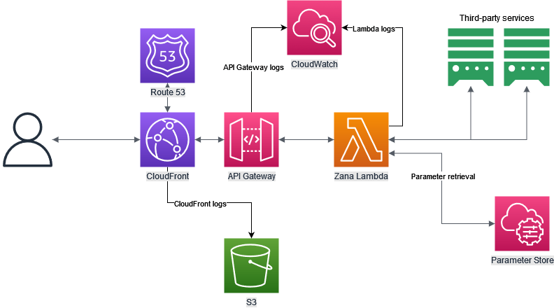

# zana


Zana is a browser extension that attaches additional book information and ratings to supported bookstores.
The external data is retrieved from a list of third-party APIs.

## Installation

You can install the extension from the following stores
- [Chrome](https://chrome.google.com/webstore/detail/zana/dfjgjgjgjgjgjgjgjgjgjgjgjgjgjgj)
- [Firefox](https://addons.mozilla.org/en-US/firefox/addon/zana/)
- [Edge](https://microsoftedge.microsoft.com/addons/detail/zana/dfjgjgjgjgjgjgjgjgjgjgjgjgjgjg)

## Third-party APIs

Zana has the following clients, which are used to retrieve additional book information and ratings
- Client for [Google Books API](https://developers.google.com/books)
- Client for [Open Library API](https://openlibrary.org/developers/api)
 
## Supported bookstores

- [Dukagjini Bookstore](https://dukagjinibooks.com/)

## Development

The project is built as a monorepo, and it uses different tools for API clients, browser extension, deployment, and release handling.
It contains the following directories:
- `services` - Rust crates that contain the API clients and the AWS Lambda function that serves the data retrieved from the clients.
- `extension` - Browser extension that is built using WebExtensions API.
- `deployment` - AWS CDK project that contains the infrastructure.
- `release` - Rust binary that helps with release management.

Zana is built primarily for Firefox, but it uses browser polyfills to support Chrome and Edge.

### Required tools

- [Rust 1.68.0](https://www.rust-lang.org/) (`services`, `release`)
- [Cargo Lambda 0.17.1](https://www.cargo-lambda.info/) (`services`)
- [Node.js v18.14.2](https://nodejs.org/en) (`extension`, `deployment`)
- [Web-ext 7.6.1](https://github.com/mozilla/web-ext) (`extension`)
- [AWS CLI 2.10.3](https://aws.amazon.com/cli/) (`deployment`)
- [AWS CDK + AWS CDK CLI 2.67.0](https://docs.aws.amazon.com/cdk/v2/guide/cli.html) (`deployment`)
- [Java 17](https://www.oracle.com/java/technologies/javase/jdk17-archive-downloads.html) (`deployment`)

### Services

The services are Rust crates (libraries and binaries) that make the clients that talk to third-party APIs, and the AWS Lambda function
that serves the data retrieved from the clients in a generic format.

#### Zana service

The `zana` service is a Rust crate that provides functionality to retrieve book information from third-party APIs.
It does so by providing a generic clients for each third-party API, and a generic data model that is used to represent the data retrieved from the APIs.
Even though currently it is used only by `zana_lambda`, it is built as a separate library crate so that it can be used easily later on in other Rust binary crates
built for other cloud providers or as a generic HTTP service.

You can build `zana` service by running the following command in the `services/zana` directory

```bash
cargo build
```
or test it by running
```bash
cargo test
```

#### Zana Lambda

`zana_lambda` is a Rust binary crate that contains the AWS Lambda function that serves the data retrieved from third-party APIs.
It uses the `zana` library crate to make clients for each supported third-party API.

##### Environment variables

###### Required

- `ZANA_ENV`, environment that is used on AWS Parameter Store queries as part of the key, to provide support for same parameters on multiple environments.

###### Set automatically AWS Lambda runtime
- `AWS_SESSION_TOKEN`, token used to access AWS Parameter Store.
- `PARAMETERS_SECRETS_EXTENSION_HTTP_PORT`, [port to be used by the AWS Parameter Store lambda extension](https://docs.aws.amazon.com/secretsmanager/latest/userguide/retrieving-secrets_lambda.html#retrieving-secrets_lambda_env-var).

###### Optional

- `ZANA_GOOGLE_BOOKS_URL`, use if you do not want to fetch the URL from AWS Parameter Store.
- `ZANA_GOOGLE_BOOKS_KEY`, use if you do not want to fetch the API key from AWS Parameter Store.
- `ZANA_OPENLIBRARY_URL`, use if you do not want to fetch the URL from AWS Parameter Store.

##### AWS Parameter Store support

[AWS Parameter Store](https://docs.aws.amazon.com/systems-manager/latest/userguide/systems-manager-parameter-store.html) is used
to retrieve parameters required to initialize clients for different third-party APIs, if those parameters are not provided as
environment variables.

`zana_lambda` uses the following parameter names to query parameter from the AWS Parameter Store. `prod` represents the environment, and it should change
based on the environment that is used.
- `/zana/prod/google-books-url`
- `/zana/prod/google-books-key`
- `/zana/prod/openlibrary-url`

Value of the environment variable `ZANA_ENV` is used as part of the key when retrieving parameter values,
in order to provide support for multiple environments at the same time.

##### Adding to AWS Parameter Store for production

```sh
aws ssm put-parameter --name "/zana/prod/google-books-url" --value "VALUE-HERE" --type String
aws ssm put-parameter --name "/zana/prod/google-books-key" --value "VALUE-HERE" --type SecureString
aws ssm put-parameter --name "/zana/prod/openlibrary-url" --value "VALUE-HERE" --type String
```

##### Running locally

The easiest way to test `zana_lambda` locally, is with [cargo lambda](https://www.cargo-lambda.info/guide/getting-started.html).

Once `cargo lambda` is installed, you need to create a `.env` file in the `services/zana_lambda` directory.
This file should contain the following variables when running locally

```
AWS_SESSION_TOKEN=token-example-123
PARAMETERS_SECRETS_EXTENSION_HTTP_PORT=2773
ZANA_ENV=local
ZANA_GOOGLE_BOOKS_URL=https://www.googleapis.com
ZANA_GOOGLE_BOOKS_KEY=<YOUR-GOOGLE-BOOKS-KEY>
ZANA_OPENLIBRARY_URL=https://openlibrary.org
```

`AWS_SESSION_TOKEN` and `PARAMETERS_SECRETS_EXTENSION_HTTP_PORT` are variables which are provided by the Lambda Runtime
on other environment, and they're required to communicate with _AWS Parameter Store_.
Since the _Parameter Store_ is not used when testing locally, those 2 environment variables do not have any function on local environment.

Additional environment variables (not required on other envs) are added to replace values that would be fetched from the _Parameter Store_.
`ZANA_GOOGLE_BOOKS_URL`, `ZANA_GOOGLE_BOOKS_KEY` and `ZANA_OPENLIBRARY_URL` are meant as a replacement for _Parameter Store_ values when running locally.

Those can be utilized on other environments as well, if you do not want to use _Parameter Store_ to fetch those values.

##### Starting the lambda locally

To start the lambda locally, change your directory to `services/zana_lambda` and run
```sh
cargo build
```

After the build is completed run
```sh
cargo lambda watch --env-file .env
```
where `.env` is the file containing the environment variables mentioned above.

##### Query using any HTTP client

The lambda should start on port `9000` by default.

_Request for OpenLibrary_
```
GET http://localhost:9000/lambda-url/zana_lambda?type=openlibrary&isbn=9781591026419
```

_Request for Google Books_
```
GET http://localhost:9000/lambda-url/zana_lambda?type=googlebooks&isbn=9781591026419
```

### Deployment

AWS CDK with _Java_ is used to define the infrastructure, which is primarily built around serverless services provided by AWS.
The deployment is done automatically once a PR is merged into the `main` branch, using _GitHub Actions_.



#### Useful commands

Change your directory to `deployment/zana_aws` to run the following commands

* `mvn package`     compile and run tests
* `cdk ls`          list all stacks in the app
* `cdk synth`       emits the synthesized CloudFormation template
* `cdk deploy`      deploy this stack to your default AWS account/region
* `cdk diff`        compare deployed stack with current state
* `cdk docs`        open CDK documentation

#### What is required before the deployment

- To have a hosted zone in `Route 53`
- Certificate for *.yourdomain.com in us-east-1, and to create records for it in `Route 53`
- Parameters set into `AWS Parameter Store`

#### Required parameters on Parameter store

 `prod` is used by default if not environment is specified.

- `/zana/prod/google-books-url` - type: `String`, URL for Google Books API
- `/zana/prod/google-books-key` - type: `SecureString`, API Key for Google Books API
- `/zana/prod/openlibrary-url` - type: `String`, URL for OpenLibrary API

- `/zana/prod/certificate-arn` - type: `String`, Certificate ARN from AWS Certificate Manager
- `/zana/prod/api-host` - type: `String`, API host name to be used by zana
- `/zana/prod/hosted-zone-id` - type: `String`, Route53 Hosted zone ID
- `/zana/prod/hosted-zone-name` - type: `String`, Route54 Hosted zone name
- `/zana/prod/cors-allow-origins` - type: `String`, Comma seperated string of allowed origins
- `/zana/prod/lambda-ssm-extension-arn` - type: `String`, ARN for Lambda SSM extension
- `/zana/prod/lambda-insights-extension-arn` - type: `String`, ARN for Lambda Insights extension
